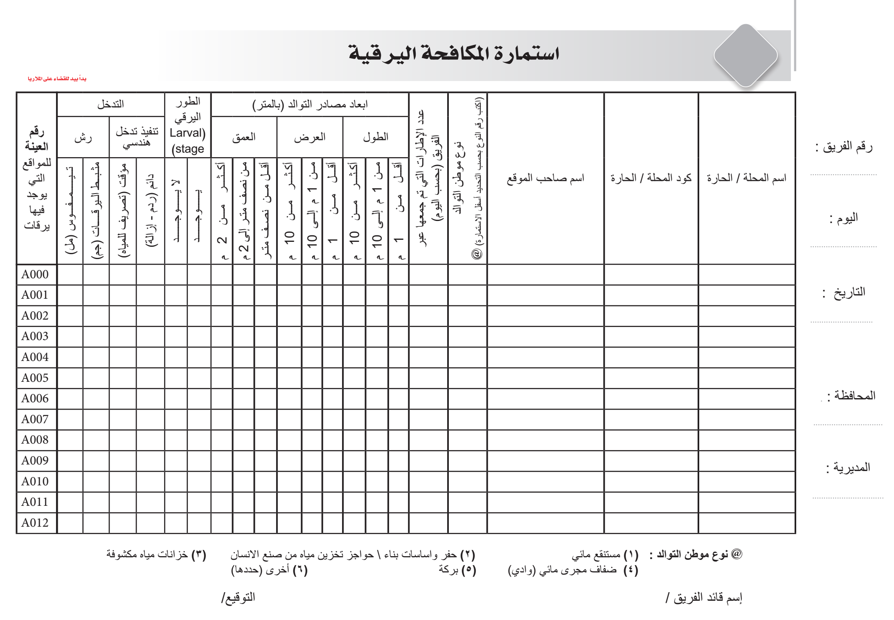
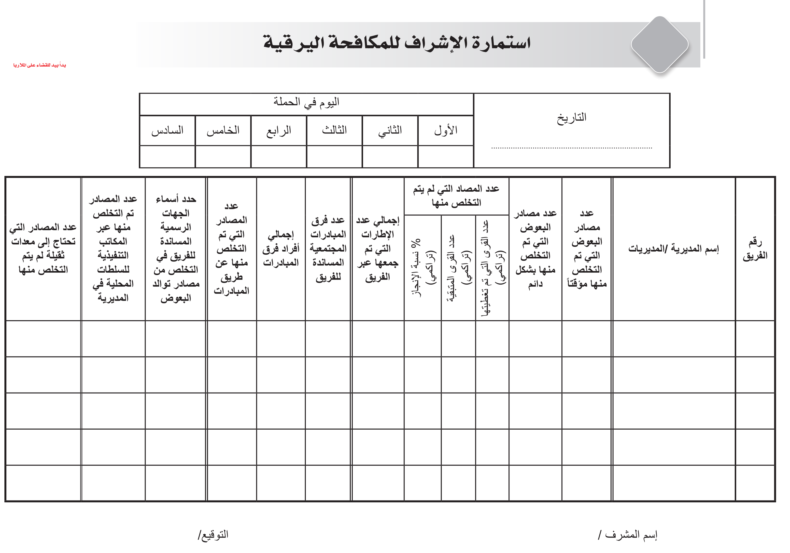

# larvicide-2024
contains the documentation of Data Run setup to manage the larg scale campagin done in 2024

NMCP is currently testing the app in a large-scale larvicide spray campaign across 8,000 villages. The campaign covers 6 governorates and 38 districts, with 40 teams and 14 supervisors involved. Official and community groups will also participate.

Each team targets anopheles mosquito breeding sites in multiple villages. Teams will report on the sites they treat, and supervisors will give summaries of their team’s progress, along with reports on community and official involvement.

We're still building the front end to manage, analyze, and display the submitted data. For now, I’ve set up a temporary Power BI dashboard that connects to the DataRun API to help the operations team track progress.

The app is installed with 40 teams and 14 supervisors submitting data daily.

Working on the app a week before the campaign started was tough but rewarding. Despite the pressure, it was a great experience, and I’ll share more about it in future posts.

## Campaign Forms Created in DataRun

### Team Form:

A daily report on a team's work, usually targeting multiple breeding sites in one village.

### Supervisor Form:

## DataRun Structure for This Campaign

This is a good time to describe how the current DataRun setup manages the campaign’s data.

### DataRun Main Entities (PostgreSQL DB)

- **Project**: Each department’s efforts can be a project. For example, ITNs mass distribution and this larvicide campaign are both projects with activities carried out periodically.
- **Activity**: Holds one or more project activities. Each activity has assigned teams, targets from `OrgUnits`, and `DataForms` for progress tracking.
- **OrgUnit**: Represents locations in a parent-child structure (Governorate, District, Village, etc.), currently with over 10,000 records.
- **Team**: Follows a tree structure like `OrgUnit`, with supervisor teams managing others below them.
- **Assignment**: Links `Team`, `OrgUnit`, and `Activity`, showing planned targets and schedules.
- **User**: Stores user accounts. Teams are assigned in the field, and supervisors link users to their teams. Once linked, users can access team activity, assigned `OrgUnits`, and submission forms.

### DataRun Data Collection Entities (MongoDB)

- **DataForm**: Defines form templates, similar to DHIS2 event structures or ODK XLS definitions.
- **DataFormSubmission**: Represents submitted form instances with data.

## Larvicide Campaign Setup in DataRun

- `OrgUnits` were uploaded.
- Two activities were created: one for field teams and one for supervision.
- 54 teams were created (40 field teams, 14 supervisors).
- Supervisors were assigned to districts, and teams to villages through assignments.
- Two form templates were created, mirroring the paper forms:

### Team and Supervisor DataRun Form Templates

- [Team Form Template](team-form-template.json)
- [Supervisor Form Template](supervisor-form-template.json)

### Dashboard Setup

...

---

More details and challenges faced will be included in future posts...

